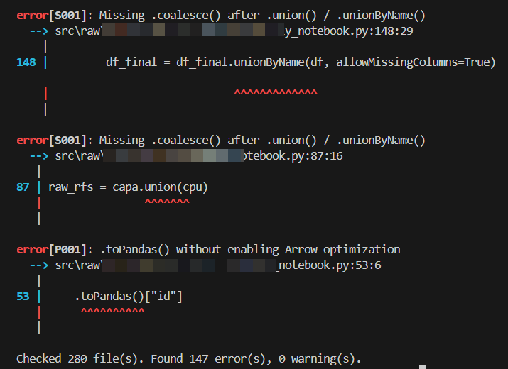
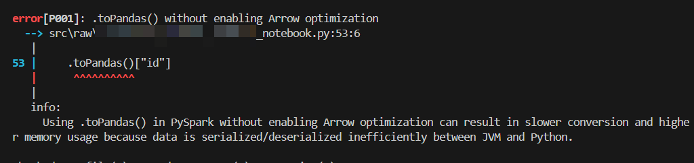
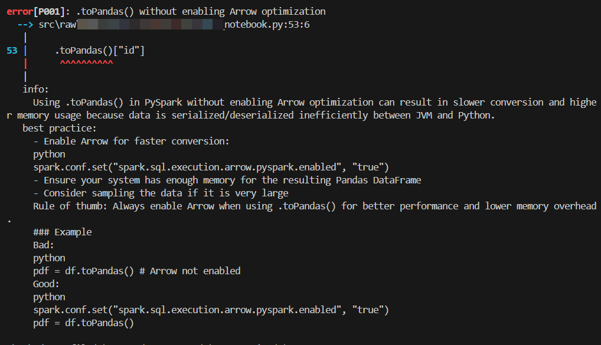

[](https://pypi.org/project/pyspark-antipattern/)
[](https://github.com/skanderboudawara/pyspark-antipattern/actions/workflows/release.yml)
[](https://pypi.org/project/pyspark-antipattern/)
[](https://github.com/skanderboudawara/pyspark-antipattern/issues)
[](https://skanderboudawara.github.io/pyspark-antipattern/)

# pyspark-antipattern

A fast, opinionated PySpark linter that challenges your code against antipattern rules — written in Rust, installable as a Python package, and designed to run in CI/CD pipelines.

> **This linter is intentionally strict.** It will flag patterns that are technically valid Python but known to cause performance, scalability, or maintainability problems in PySpark. Every violation is a conversation starter, not necessarily a hard blocker — it is up to you to decide whether to fix it, downgrade it to a warning, or suppress it for a specific line. The goal is to make the trade-offs visible before they become production incidents.

---

## Why this exists

PySpark is easy to misuse. `.collect()` on a 10 GB DataFrame, `.withColumn()` called in a loop, UDFs where built-in functions exist — these patterns work fine locally and silently destroy performance at scale. This tool catches them early, at commit time, before they reach your cluster.

---

## Installation

```bash
pip install pyspark-antipattern
```

---

## Usage

Check a single file:
```bash
pyspark-antipattern check pipeline.py
```

Check an entire directory recursively:
```bash
pyspark-antipattern check src/
```

Use a custom config location:
```bash
pyspark-antipattern check src/ --config path/to/pyproject.toml
```

**Exit codes**
- `0` — no errors (warnings are allowed)
- `1` — one or more error-level violations found

---

## CLI output

Default output — violations only:



Each violation line includes a colored severity badge — `[HIGH]` in red, `[MEDIUM]` in yellow, `[LOW]` in green — immediately after the rule ID:

```
error[D001][HIGH]: Avoid using collect()
  --> pipeline.py:42:10
```

Filter by severity directly from the CLI:

```bash
pyspark-antipattern check src/ --severity=high    # only HIGH violations
pyspark-antipattern check src/ --severity=medium  # MEDIUM and HIGH
```

With `show_information = true` — inline explanation for each rule:



With `show_best_practice = true` — best-practice guidance for each rule:



---

## Rules

Full documentation is available at **https://skanderboudawara.github.io/pyspark-antipattern/**.

Rules are organized by category in the [`docs/rules/`](docs/rules/) folder. Each rule has its own markdown file with a full explanation, best-practice guidance, and a severity badge indicating its performance impact.

| Category | Folder | Focus |
|---|---|---|
| **ARR** — Array | [`docs/rules/arr/`](docs/rules/arr/) | Array function antipatterns |
| **D** — Driver | [`docs/rules/driver/`](docs/rules/driver/) | Actions that pull data to the driver node |
| **F** — Format | [`docs/rules/format/`](docs/rules/format/) | Code style and DataFrame API misuse |
| **L** — Looping | [`docs/rules/looping/`](docs/rules/looping/) | DataFrame operations inside loops |
| **P** — Pandas | [`docs/rules/pandas/`](docs/rules/pandas/) | Pandas interop pitfalls |
| **PERF** — Performance | [`docs/rules/performance/`](docs/rules/performance/) | Runtime performance antipatterns |
| **S** — Shuffle | [`docs/rules/shuffle/`](docs/rules/shuffle/) | Joins, partitioning, and data movement |
| **U** — UDF | [`docs/rules/udf/`](docs/rules/udf/) | User-defined functions and their alternatives |

Each rule carries a **severity** reflecting its performance impact:

| Severity | Meaning |
|---|---|
| 🔴 **HIGH** | Major performance impact — OOM risk, full scans, shuffle explosion |
| 🟡 **MEDIUM** | Moderate performance impact — avoidable overhead at scale |
| 🟢 **LOW** | Minor impact — style, API correctness, small inefficiencies |

---

## Configuration

Add a `[tool.pyspark-antipattern]` section to your project's `pyproject.toml`:

```toml
[tool.pyspark-antipattern]

# Show only these rules — everything else is silenced (default: all active)
# select = ["D001", "S"]

# Downgrade these rules from error to warning (exit code stays 0)
warn = ["F008", "F011"]

# Completely silence these rules — no output, no exit code impact
# Accepts exact rule IDs or single-letter group prefixes
ignore = ["S004"]                # silence one rule
# ignore = ["F"]                 # silence all F rules
# ignore = ["S", "L", "D001"]    # silence all S and L rules

# Only report violations at or above this performance-impact level (default: all)
# severity = "medium"            # show only MEDIUM and HIGH violations
# severity = "high"              # show only HIGH violations

# Show inline explanation for each rule that fired (default: false)
show_information = false

# Show best-practice guidance for each rule that fired (default: false)
show_best_practice = false

# PERF003: fire when more than N shuffle ops occur without a checkpoint (default: 9)
max_shuffle_operations = 9

# S004: flag when the weighted count of .distinct() calls exceeds this (default: 5)
distinct_threshold = 5

# S008: flag when the weighted count of explode() calls exceeds this (default: 3)
explode_threshold = 3

# L001/L002/L003: flag for-loops where range(N) > threshold;
#                 while-loops always assume 99 iterations (default: 10)
loop_threshold = 10

# Directories to skip during recursive scanning (default: common build/venv dirs)
# exclude_dirs = ["my_generated_code", "vendor"]
```

### Suppressing a specific line

Add a `# noqa: pap: RULE_ID` comment to suppress one or more rules on that line:

```python
result = df.collect()  # noqa: pap: D001
bad_join = df.crossJoin(other)  # noqa: pap: S010, S002
```

---

## CI/CD integration

### GitHub Actions

```yaml
- name: Lint PySpark code
  run: |
    pip install pyspark-antipattern
    pyspark-antipattern check src/
```

The job fails automatically if any error-level rule fires. Warnings are reported but do not block the pipeline.

### Pre-commit hook

```yaml
# .pre-commit-config.yaml
repos:
  - repo: local
    hooks:
      - id: pyspark-antipattern
        name: PySpark antipattern linter
        entry: pyspark-antipattern check
        language: system
        types: [python]
        pass_filenames: false
        args: ["src/"]
```

---

## A word on strictness

This linter will challenge code that your team may have written deliberately and knowingly. That is by design.

Each violation is not a verdict — it is a question: *"Did you mean to do this, and do you understand the trade-off?"* If the answer is yes, suppress the rule on that line or downgrade it to a warning in your config. If the answer is no, you just avoided a production issue.

The strictest setup is the default: every rule is a hard error. Relax only what you have a documented reason to relax.

---

## Author

**Skander Boudawara** — [skander.education@proton.me](mailto:skander.education@proton.me)
